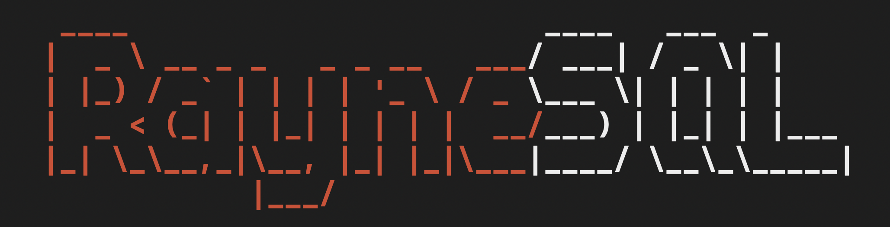

<div align="center">
    
    <p>
        RayneSQL is a transactional SQL-like client-server command-line interface program.
        The server manages concurrent clients through TCP socket connections that are handled through execution 
        in dedicated threads. The implemented query language is a simplified version SQL, supporting 
        selects, updates, joins, inserts, alters, and more (see BNF for full grammar).
    </p>
</div>

## How To Run

1. Clone the repo and navigate to its top level
```
git clone git@github.com:TomRaynes/RayneSQL.git
cd RayneSQL
```
2. Start the server
```
./server
```
3. Start the client
```
./client
```